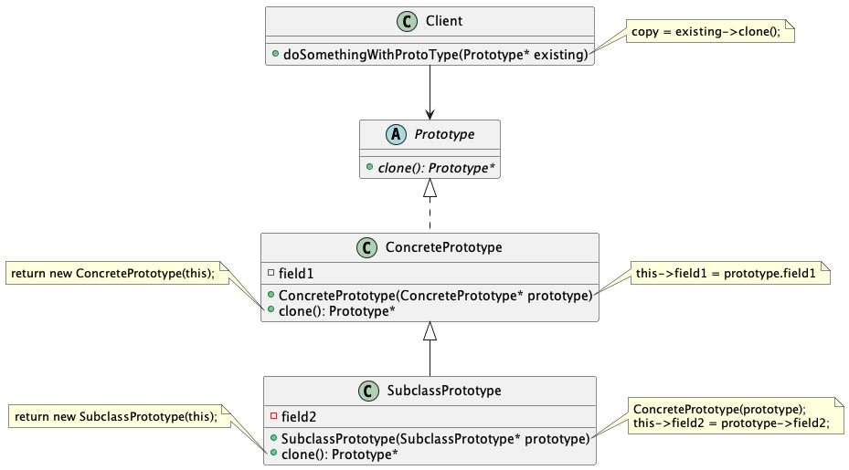
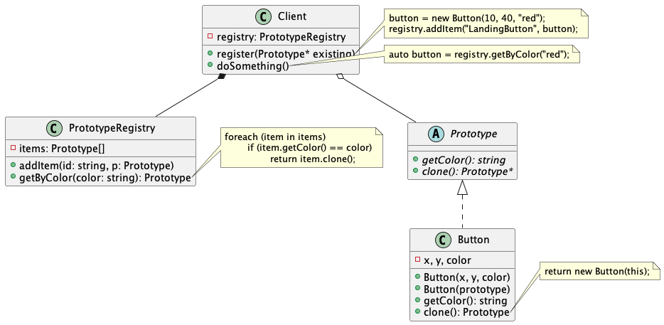

# Creational Design Patterns

## Build different products with the same interface

### Client class

A Client object will do something with the relevant products. A class that defines such an operation is called a Client class.

### Factory Method Pattern (for one product)

Factory Method Pattern is implemented by **inheritance**.

A Client object needs to create a certain product with the interfaces defined in `AbstractProduct`.

The Factory Method (`factoryMethod(): AbstractProduct`) separates product construction from the client object that actually uses the product. To add a new product type to the app, you only need do two things:
1. Define a new `ConcreteProduct` by subclassing `AbstractProduct`.
2. Define a new `ConcreteClient` by subclassing `AbstractClient` and override the `factoryMethod()` therein to create a `ConcreteProduct` object and to return an `AbstractProduct` pointer.


If we have multiple products to be used by the Client, the `Factory Method Pattern` becomes cumbersome, as shown in the Fig.


In this case, we can put a factory object instead of a factory method in the Client class, such that its interfaces become simpler.

### Abstract Factory Pattern (for a family of products)

Use the Abstract Factory when your code needs to work with various families of related product, but you don't want it to depend on the concrete classes of those products.

**The abstract factory is injected into the client**, which means that Abstract Factory Pattern is implemented by *Composition*.


## Build complex objects (with a lot of optional parameters) step by step

### Builder Pattern

Use the Builder Pattern to get rid of a "telescoping ctor", such as,
```cpp
class Pizza {
    Pizza(int size) { ... }
    Pizza(int size, boolean cheese) { ... }
    Pizza(int size, boolean cheese, boolean pepperoni) { ... }
    // ...
```

The Builder Pattern organizes object construction into a set of steps, but you don't need to call all of the steps. Some of the steps might require different implementation, and therefore you can create several different builder classes that implement the same set of building steps.

Such a Builder class gives you the full freedom to fine-tune the constructed object, but might seem cumbersome for some common and popular options. In this case, you can define a separate class called `Director` that implements receipts for some common builder options.


## Copy existing complex objects

### Prototype Pattern

An object that supports cloning is called a `prototype`. Such objects are usually very hard to construct.

The Prototype pattern delegates the cloning process to the actual objects that are being cloned. The pattern declares a common `.clone()` interface for all objects that support cloning, which lets you clone an object **without coupling your code to the class of that object**.



The `Prototype Registry` provides an easy way to access frequently-used prototypes. It stores a set of pre-built objects that are ready to be copied. The simplest prototype registry is a `name -> prototype` hash map.



## Control access to shared resource

### Singleton Pattern

Use the Singleton pattern when a class in your program should have just a single instance available to all clients.

It is also a type of "lazy initialization".

It requires special treatment in a multithreaded environment so that multiple threads won't create a singleton object several times.

All implementations of the Singleton have these two steps in common:
1. Make the default ctor private.
2. Create a static creation method that calls the private ctor, and save the created object in a static field. All future calls to this method return the cached object.

