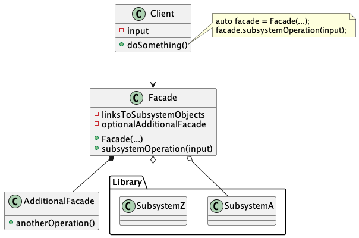
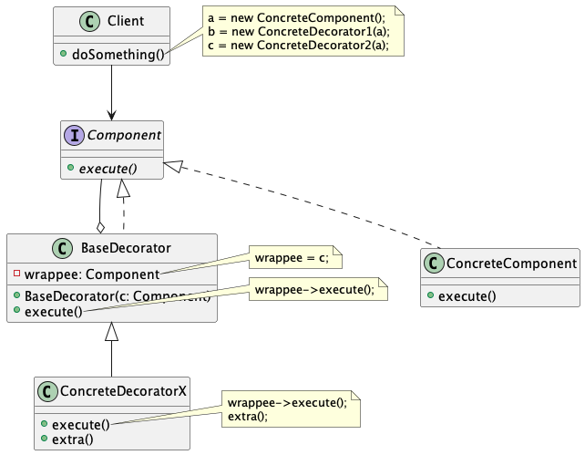

# Structural Patterns

## Provide a simplified interface to a library

### Facade Pattern

A Facade class is handy when you need to integrate your app with a sophisticated library that has dozens of features, but you just need a tiny bit of its functionality.

An **Additional Facade** class can be created to prevent polluting a single facade with unrelated features.

## Attach new behaviors to objects

### Decorator Pattern

Extending a class through subclassing (aka, inheritance) has several serious caveats:
1. Inheritance is static. You can't alter the behavior of an existing object at runtime.
2. Subclasses can have just one parent class in C++.

One way to overcome these caveats is by using Aggregation or Composition instead of Inheritance.

*Wrapper* is the alternative nickname for the Decorator pattern. A `wrapper` is an object that can be linked with some target object. The wrapper contains the same set of methods as the target and delegates to it all requests it receives. However, the wrapper may alter the result by *doing something before or after it passes the requests to the target*.

Since all decorators implement the same interface as the base class, from the client's perspective these objects are identical.

Many programming languages have the `final` keyword that prevent further extension of a class. For a `final` class, the only way to reuse the existing behavior would be to wrap the class with your own wrapper, using the Decorator pattern.